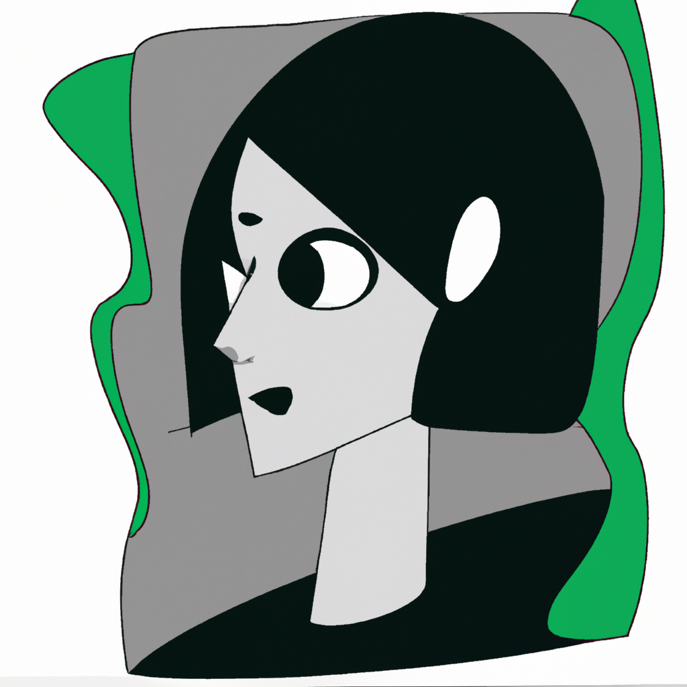
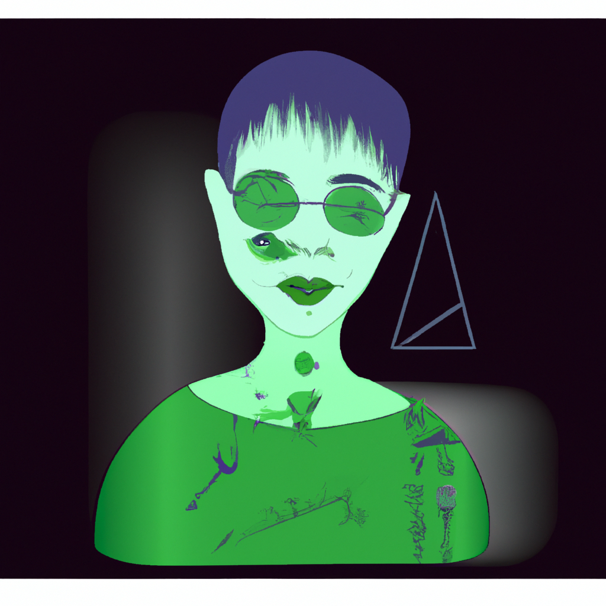
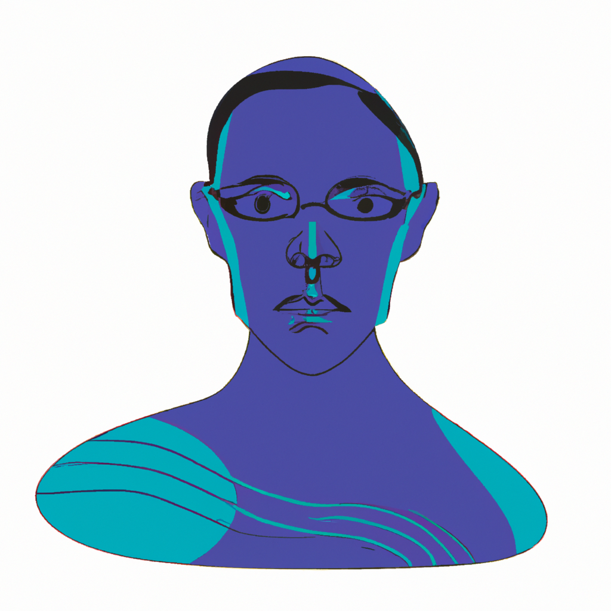

# Avatar Generation with OpenAI

This code generates a unique user avatar using the OpenAI API. The generated avatar depicts an alien, facing forward, shoulder up, gender ambiguous, with a random color, and an abstract style. The image avatar fills the space of the image with a resolution of 1024x1024 pixels.

## Requirements

- Python 3.x
- openai

## Setup

1. Sign up for an API key from OpenAI: [https://openai.com/signup](https://openai.com/signup)
2. (Change or) Create a Python file called `API_KEY.py` in the same directory as the code.
3. Inside `API_KEY.py`, define a variable called `api_key` and assign your OpenAI API key as the value. Keep this key safe and do not publish it.

## Usage

You can modify the prompt in the avatar_gen() function to generate avatars with different characteristics. running the script will give you the url for the image.

## Cost

Please note that using the OpenAI API for image generation may incur costs. Check the OpenAI website for the pricing details: https://openai.com/pricing 
as far as I am aware openai may give grants to non-profit orgs.

## Examples

Here are some examples of generated avatars:

